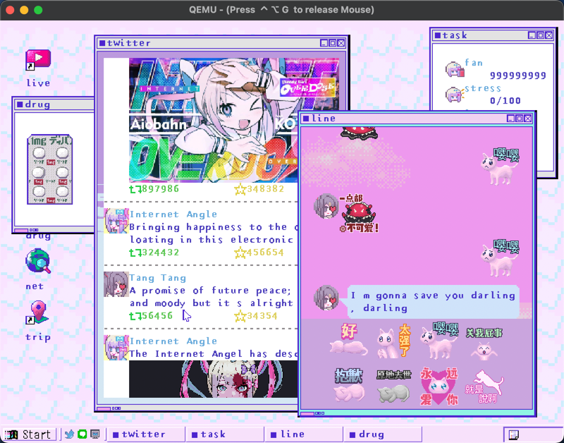
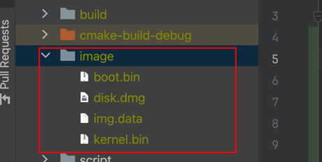

# 模仿《直播女孩重度依赖》的界面写的操作系统
<br>
视频演示：https://www.bilibili.com/video/BV183v1edExQ
# 前置准备
因为 github 不允许上传大文件，会对磁盘文件，系统使用的图片资源进行打包。下载完毕项目后需要解压 image.zip 文件。<br>
<br>
boot.bin 是引导扇区文件，kernel.bin 是操作系统核心文件，这两个文件都会在编译后自动生成。<br>
disk.dmg 是磁盘文件，可以自己写一个 256m 的全 0 磁盘文件来代替，img.data 是图片资源包。<br>
资源包格式可以参考 NEEDY-GIRL-OVERDOSE-OS/source/kernel/gui/img.c img_init() 的实现
# 参考信息
https://www.bilibili.com/video/BV1jV4y1H7Gj
主体项目框架使用了这视频教程的，推荐前面可以跟着做一下，先把 DEBUG 环境搭建起来后面还很方便<br>
界面绘制主要参考《30天自制操作系统》<br>
其他的就是纯属自由发挥了
# 运行系统
```shell
brew install qemu
qemu-system-i386  -m 128M -drive file=disk.dmg,index=0,media=disk,format=raw
```
需要安装qemu模拟器，执行qemu模拟器需要保证其目录包含disk.dmg磁盘文件
# 编译调试
```shell
brew install x86_64-elf-gcc
brew install x86_64-elf-gdb
brew install cmake
brew install qemu
qemu-system-i386  -m 128M -s -S -drive file=disk.dmg,index=0,media=disk,format=raw
```
x86_64-elf-gcc 与 x86_64-elf-gdb 主要是用于交叉编译<br>
实际项目主体框架在看完下面这个视频前几节后你就会明白了
https://www.bilibili.com/video/BV1jV4y1H7Gj